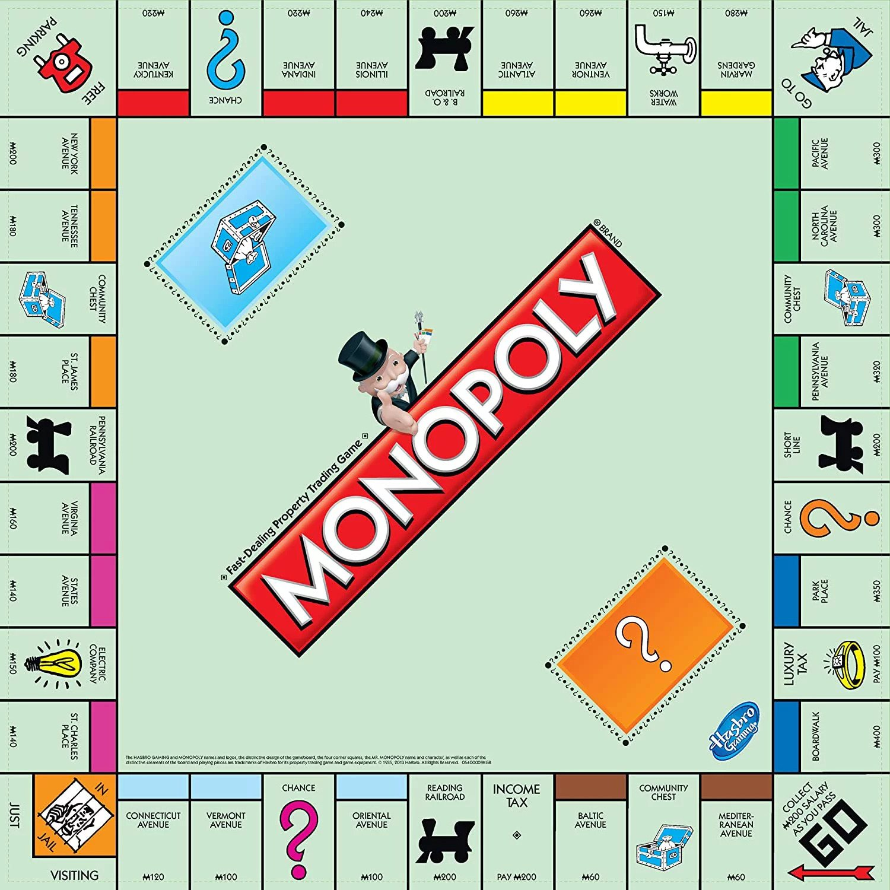

## Limitations
+ Only two players can play.
+ Bank and the banker are not explicitly implemented.
+ Each player is identified by a unique name and there is no need for a token (cat, dog, ...).
+ Title deed cards are not explicitly implemented, but are implemented in each property class.
+ Auction and exchange is not implemented.
+ Building and destroying houses are done after each player's turn.
+ There are no limitations on the overall number of houses and hotels, i.e. there can be more than
32 houses or 12 hotels.
+ Chance and community chest is not implemented.
+ Bankruptcy is defined either by running out of money or net worth, depending pn the analysis.
## Rules

+ Each player is given 500$ initially.
+ The game starts at GO! (square number 0) and moves clockwise around the board.
+ The starting player is chosen randomly.
+ The game is played sequentially and in each turn, the player's move is determined by the sum of two dice.
+ The same player has to play again in case of a double. Three consecutive doubles sends the player to
jail.
+ The board consists of different squares, most of them being properties. One such property is a street, 
each having a different color. Four of the properties are railways, and two of them utilities.
+ If a player lands on a property, if it is not already owned, they can buy it. But if it is already 
owned by the opponent, they have to pay rent.
+ Each street has a rent depending on its color and if a player buys all of the properties, the rent will be doubled.
If houses or hotels are built on a street, the rent will be calculated using [this information](https://en.wikibooks.org/w/index.php?title=Monopoly/Properties_reference&oldid=4219992).
+ Houses can be built on streets of color set if and only if all the streets of the color set are already 
owned by the player and none of them are mortgaged. House costs are based on [this information](https://www.monopolyland.com/buying-
houses-rules/).
Each street is allowed to have at most one more house than other streets in the color set and cannot exceed four houses.
+ Four houses can be upgraded to a hotel. It costs four houses and the cost of the hotel, hotel cost 
being the same as the house cost on the street.
+ Railroad and utility rents are based on [this information](https://en.wikibooks.org/w/index.php?title=Monopoly/Properties_reference&oldid=4219992).
+ Landing on houses 4 and 38 demands for a specific rent.
+ Landing on chance, community chest and squre 20 has no effect.
+ 200$ is gained by landing or passing GO!.
+ Landing on jail (square 10) has no effect. Landing on square 30 or three consecutive doubles sends the 
player to jail, and passing GO! in this case will gain them no money.
+ Player has to pay 50$ to get out of the jail or roll the dice when in jail, and if the dice is double, 
they get out of the jail. When removed from the jail, they move and continue to play. If they remain in 
jail, thay cannot move on the board, but they can buy, mortgage, ... . After three consecutive turns remaining 
in the jail, the player gets out by paying 50$.
+ Buldings can be sold for half their price, but they can be sold only if each street has at most one 
building more than the others in the color set. In case of selling a hotel, four houses will be replaced.
+ One way to increase the player's money is by mortgage. This is only possible if there are no buildings 
on the street already. While in mortgage, the owner cannot get rent by that property. A property can be 
unmortgaged by paying the same mortgage cost plus 10% of the same cost.
+ The game is finished when a player goes bankrupt.
## Considerations
The game and the AI need major improvements. A complete report of the AI implementation as well as other
explanations are available in the report as well.